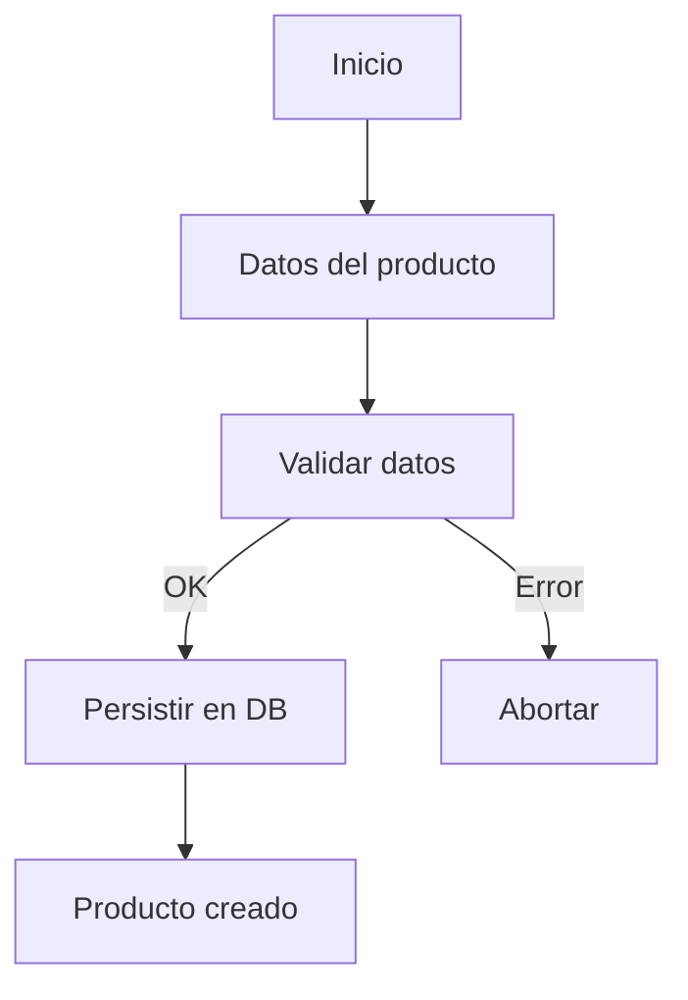
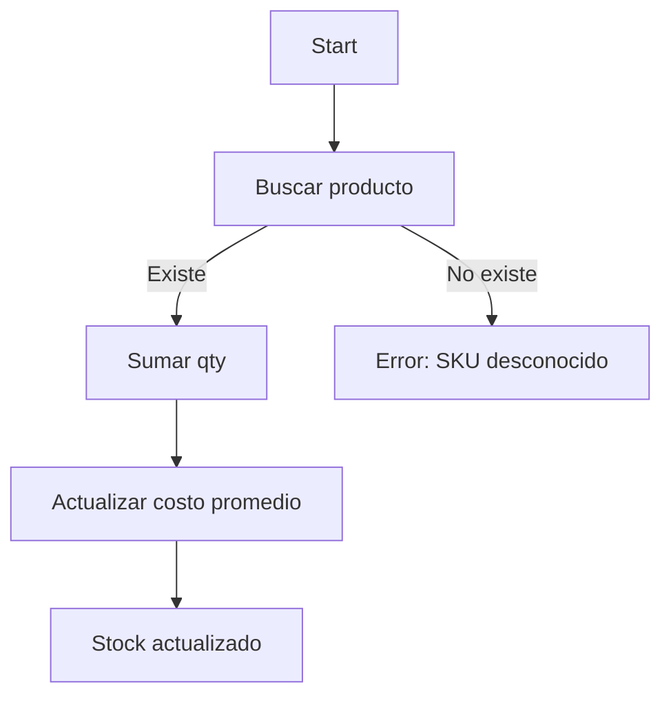
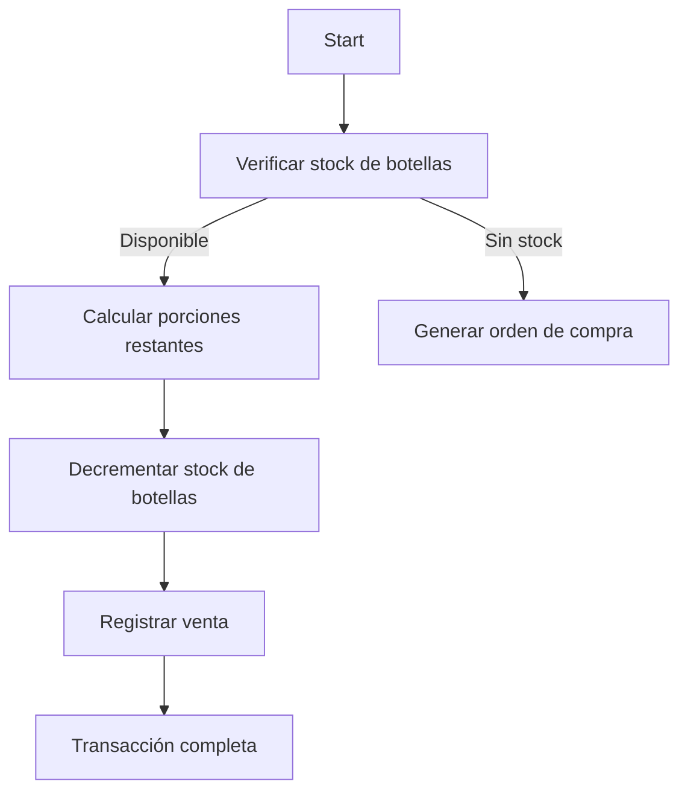
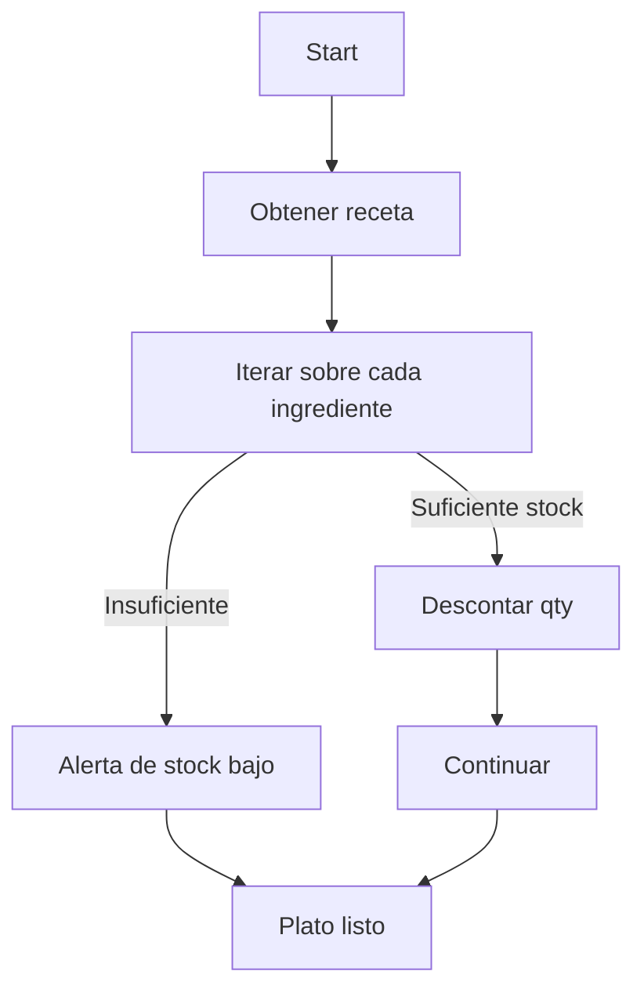
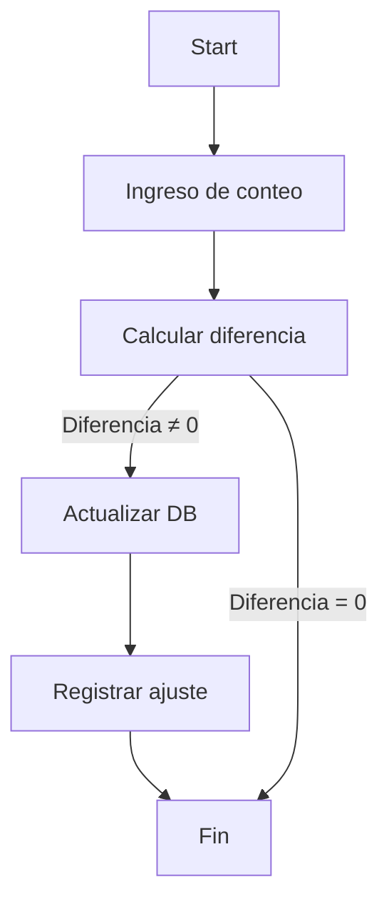

# Inventario y Gestión de Stock

## 📋 Visión General

Este documento describe **todas las funciones de inventario** necesarias para gestionar bebidas y comidas en el sistema de Cyberbistro. Cada función está acompañada de:

- **Descripción breve**
- **Flujo de datos (Mermaid)**
- **Consideraciones de negocio**
- **Mejoras y sugerencias**

---

## 1️⃣ Registro de Producto

```typescript
/**
 * Registra un nuevo producto en el catálogo.
 * @param sku   Identificador único del producto
 * @param name  Nombre descriptivo
 * @param type  "bebida" | "comida"
 * @param unit  "botella" | "vaso" | "porción"
 * @param price Precio unitario (USD)
 * @param qty   Cantidad inicial en stock
 */
function crearProducto(sku: string, name: string, type: "bebida" | "comida", unit: "botella" | "vaso" | "porción", price: number, qty: number): void;
```

**Flujo**


### Mejora sugerida
- **Validación de SKU** con checksum para evitar duplicados.
- **Auditoría**: registrar `createdBy` y `createdAt`.

---

## 2️⃣ Entrada de Stock (Compra de Botellas / Ingredientes)

```typescript
/**
 * Aumenta el stock de un producto existente.
 * @param sku   SKU del producto
 * @param qty   Cantidad recibida (en unidades de compra)
 * @param cost  Costo total de la compra
 */
function recibirStock(sku: string, qty: number, cost: number): void;
```

**Flujo**


### Mejora sugerida
- **Control de lotes**: almacenar `batchId`, fecha de caducidad y proveedor.
- **Notificaciones**: alerta automática cuando el stock supera un umbral máximo.

---

## 3️⃣ Salida de Stock (Venta de Bebidas / Preparación de Platos)

### 3.1 Venta de Bebida (por vaso)

```typescript
/**
 * Registra la venta de una porción de bebida.
 * @param sku          SKU de la bebida (ej. "COKE")
 * @param portionSize  Tamaño del vaso en ml
 */
function venderVaso(sku: string, portionSize: number): void;
```

**Flujo**


**Regla de negocio**
- Cada botella tiene **X porciones** (configurable por producto). Al vender una porción, se decrementa la cuenta de porciones; cuando llegan a 0, se decrementa una botella.

### Mejora sugerida
- **Inventario virtual de porciones** para evitar cálculos en tiempo real.
- **UI**: mostrar "botellas restantes" y "porciones disponibles" al cajero.

---

### 3.2 Preparación de Plato (por receta)

```typescript
/**
 * Descuenta los ingredientes de una receta al preparar un plato.
 * @param recipeId ID de la receta
 * @param servings Número de porciones a preparar
 */
function prepararPlato(recipeId: string, servings: number): void;
```

**Flujo**


### Mejora sugerida
- **Gestión de sustituciones**: permitir ingredientes alternativos cuando el stock está bajo.
- **Costeo en tiempo real**: calcular costo del plato basado en precios de ingredientes actuales.

---

## 4️⃣ Ajustes de Inventario (Inventario Físico)

```typescript
/**
 * Actualiza el stock tras un conteo físico.
 * @param sku   SKU del producto
 * @param realQty Cantidad contada físicamente
 */
function ajustarInventario(sku: string, realQty: number): void;
```

**Flujo**


### Mejora sugerida
- **Historial de ajustes** con motivo (`robo`, `daño`, `desperdicio`).
- **Integración con QR**: escanear códigos de barra para acelerar la captura.

---

## 5️⃣ Reportes y Métricas

| Reporte | Descripción | Frecuencia |
|--------|-------------|------------|
| **Resumen de Stock** | Listado de SKUs con stock actual, valor total y alertas de bajo nivel. | Diario |
| **Ventas por Porción** | Volumen de vasos vendidos por bebida, comparado con botellas disponibles. | Horario |
| **Costo de Ingredientes** | Coste estimado de cada receta basado en precios de ingredientes. | Diario |
| **Ajustes de Inventario** | Registro de todas las reconciliaciones físicas. | Semanal |

### Mejora sugerida
- **Dashboard interactivo** con filtros por categoría y rango de fechas.
- **Alertas por Slack/Teams** cuando el stock cae por debajo del punto de reorden.

---

## 6️⃣ Integración con Pedidos y Producción

1. **Pedido de Cliente** → `venderVaso` o `prepararPlato`.
2. **Actualización automática** del stock en tiempo real.
3. **Reorden automático** cuando `stock <= puntoReorden` → crea registro `OrdenCompra`.
4. **Sincronización** con sistema de proveedores (API o CSV).

---

## 7️⃣ Buenas Prácticas y Sugerencias Generales

- **Unidad de medida única**: usar siempre la menor unidad (ml para bebidas, gramos para alimentos) y convertir al mostrar al usuario.
- **Separar lógica de negocio y presentación**: mantener funciones de inventario en un módulo (`inventory.service.ts`) y exponerlas vía APIs REST.
- **Pruebas unitarias**: cubrir casos de borde como `stock = 0`, `porciones por botella = 0` y `ajuste negativo`.
- **Control de concurrencia**: usar transacciones o bloqueos optimistas para evitar ventas simultáneas que sobrepasen el stock.
- **Auditoría**: cada cambio debe registrar `userId`, `timestamp` y `motivo`.

---

## 📦 Archivo generado

El archivo **inventario.md** se ha creado en la raíz del proyecto.

---

*Este documento es extensible; si necesitás agregar más funcionalidades (p.ej. gestión de devoluciones, integración con POS, control de vencimientos), podés seguir la misma estructura.*
