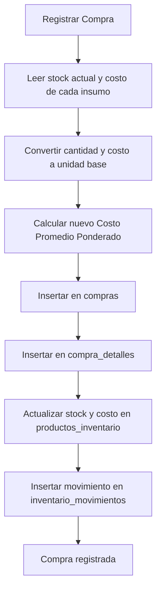

# Exploración — PR 6: Servicio Compras → Inventario → Movimiento

**Change**: `compras-inventory-service`
**Branch**: `feature/compras-inventory-service`

---

## Lógica del Servicio de Compras (`purchaseService.ts`)

Para registrar una compra local-first en Cyberbistro, necesitamos un servicio puro en `src/features/compras/lib/purchaseService.ts` que coordine múltiples inserciones y actualizaciones en la base de datos IndexedDB (a través de `enqueueLocalWrite` y `readLocalMirror`).

### 1. Flujo de Datos al Registrar Compra

Al registrar una compra, el usuario ingresa:
- Proveedor (seleccionado del maestro o creado inline).
- Tipo de pago (contado o crédito).
- Factura física (número opcional).
- Items: insumo seleccionado, cantidad comprada y costo unitario de compra.

El servicio realizará el siguiente flujo transaccional local:

### 2. Conversión a Unidad Base (Líquidos)
Si el producto tiene presentación botella (`ml_por_botella` > 0):
- `cantidad_base = cantidad_comprada * ml_por_botella`
- `costo_base = costo_compra_botella / ml_por_botella` (redondeado a 4 decimales)
Si no:
- `cantidad_base = cantidad_comprada`
- `costo_base = costo_compra_unidad`

### 3. Fórmula del Costo Promedio Ponderado
Para mantener la rentabilidad y el valor de stock correctos en recetas, la compra debe actualizar el `costo_promedio` del catálogo de inventario.
Fórmula:
- Si el stock actual es mayor a 0:
  $$\text{Costo Promedio} = \frac{(\text{Stock Actual} \times \text{Costo Promedio Actual}) + (\text{Cantidad Base} \times \text{Costo Base})}{\text{Stock Actual} + \text{Cantidad Base}}$$
- Si el stock actual es menor o igual a 0:
  $$\text{Costo Promedio} = \text{Costo Base}$$

El nuevo costo se redondea a 4 decimales en la base de datos.

### 4. Registro de Movimientos de Inventario
Por cada item comprado, se registra un movimiento de inventario (`inventario_movimientos`) con:
- `tipo`: `'entrada'`
- `cantidad`: `cantidad_base`
- `stock_antes`: `stock_actual`
- `stock_despues`: `stock_actual + cantidad_base`
- `costo_unitario`: `costo_base`
- `referencia`: `'Compra ' + compraId`
- `motivo`: `'Ingreso por compra'`

---

## Interfaz de Usuario y CRUD Proveedores

Para complementar el servicio, el PR 6 incluirá la interfaz base en `src/features/compras/components/Compras.tsx` conteniendo:
- **Tab 1: Historial de Compras**: Lista de compras realizadas por el restaurante (RNC, fecha, total, tipo de pago).
- **Tab 2: Proveedores**: CRUD (creación, edición y listado) de proveedores.
- **Formulario de Registro (Nueva Compra)**: Formulario interactivo que permite seleccionar proveedor, agregar múltiples filas de insumos, cantidad y costo, calcular totales dinámicamente y guardar la compra local-first.

---

## Estrategia de Pruebas

- Crear `src/features/compras/lib/purchaseService.test.ts`.
- Mockear `enqueueLocalWrite` y `readLocalMirror` para testear la lógica del servicio de compras.
- Probar:
  - Compra de productos simples (unidades).
  - Compra de productos con presentación líquida (botellas de 750ml).
  - Recálculo del costo promedio ponderado ante stock positivo y stock cero/negativo.
  - Generación del payload de movimientos.
